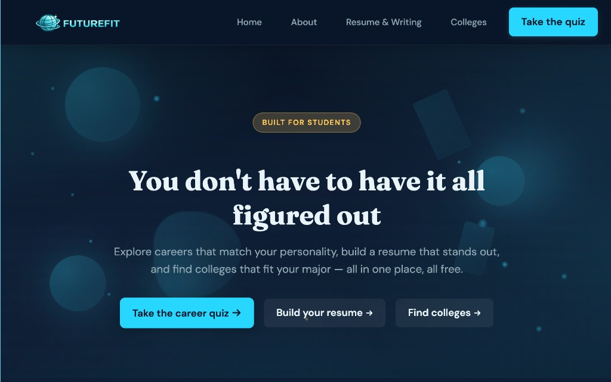

# ExploringU

**Campus to career.** Career quiz, resume templates, gap analysis, and college finder—all free for students.



## Features

| Feature | Description |
|---------|-------------|
| **Career Quiz** | Short quiz by major or explore mode; personalized job suggestions |
| **Resume Templates** | Major-specific resumes, cover letters, admissions essays + FutureBot AI |
| **Gap Analysis** | Paste resume + job posting → AI match score, missing keywords, suggestions |
| **College Finder** | Filter by major, location, cost, school type |
| **Jobs** | Live job listings from LinkedIn, Indeed, Glassdoor, ZipRecruiter & more — filtered by major |

## TODO:
- [ ] Add ability to make futurebot popup larger 
- [ ] Make resume tips section into carousel 
- [ ] Add more colleges 
- [ ] Finish sign-in functionality so users can save resumes
    - [ ] optional: make it so verification emails are sent to the user
    - [ ] add profile pictures
- [ ] consider adding mbti test
- [ ] add ability to download resumes/resume templates as docx
- [ ] add way for AI chat to reference user behavior
- [x] add way to search for jobs by major (JSearch API — LinkedIn, Indeed, Glassdoor, etc.)
- [ ] change dockerfile to use actual server instead of debug server
    - possibly using gunicorn
    - [https://www.digitalocean.com/community/tutorials/how-to-set-up-django-with-postgres-nginx-and-gunicorn-on-ubuntu#step-6-testing-gunicorn-s-ability-to-serve-the-project](https://www.digitalocean.com/community/tutorials/how-to-set-up-django-with-postgres-nginx-and-gunicorn-on-ubuntu#step-6-testing-gunicorn-s-ability-to-serve-the-project)

## Quick Start

```bash
docker compose up --build
```

Open [http://127.0.0.1:8000](http://127.0.0.1:8000).

**AI features** (gap analysis, FutureBot): add `GEMINI_API_KEY` to a `.env` file. Get a key from [Google AI Studio](https://aistudio.google.com/apikey).

**Jobs page** (live listings from LinkedIn, Indeed, etc.): add `RAPIDAPI_KEY` to `.env`. Get a free key from [RapidAPI](https://rapidapi.com/letscrape-6bRBa3QguO5/api/jsearch) (200 requests/month free). Without the key, the page shows curated career data with direct links to job boards.

## Local Setup

```bash
cd ExploringU
source venv/bin/activate
pip install -r requirements.txt
python manage.py migrate
python manage.py runserver
```

## GitHub Pages

Static preview in `docs/`. Deploy: **Settings → Pages** → source `main` / folder `docs`. Full app: use Docker.

## Structure

```
ExploringU/
├── config/           # Django settings
├── resume_analysis/  # Gap analysis
├── career_quiz/      # Quiz
├── resume/           # Templates, cover letters, essays
├── schools/          # College finder
├── jobs/             # Job market sweep (JSearch API)
├── docs/             # Static site
├── templates/
└── static/
```

## License

MIT
